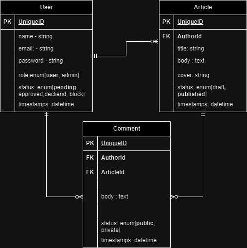

# OpenAPI Specification

https://github.com/OAI/OpenAPI-Specification/blob/main/versions/3.0.1.md

https://swagger.io/docs/specification/about/

## Project Idea

I plan to implement a REST API for a blog management system. Several special options will be available. All of the posts and comments made by users are accessible publicly. Users must be logged in to their accounts in order to make posts or comments. Each user has control over their own posts and comments. Everything needs to be managed by the admin. The user can add a custom cover image to the post.

### Check List

- Elaborate the requirements and create a formal / semi formal SRS
- Analyze The SRS
- And possible entities
- Design the ER Diagram
- Figure out possible API Endpoints
- Write down the specs for each endpoint
- Design the API using Open API Spec (will automatically generate the docs)
- Implement The API (Development)
- Write Automatic Tests (Development)

### SRS - Software Requirement Specification

1. Introduction
   The Blog REST API Application is a collection of public api endpoints that enables users to create, manage, and interact with a single author blog. The backend application provides authentication functionality, allows users to create and view articles, comment on articles, and upload cover photos for articles. This document outlines the functional and non- functional requirements for the development of the Blog REST API Application.
2. System Overview
   The Blog REST API Application aims to provide a seamless user experience while ensuring the security and integrity of user data. It allows users to browse articles without authentication, but authentication is required for commenting. Administrators have access to an admin dashboard for managing articles, comments, and cover photos.
3. Functional Requirements

   - Authentication

     - Users should be able to register for an account by providing their email address and a secure password.

     - Users should be able to log in securely using their email address and password.
     - Administrators should be able to log in securely using their credentials.

   - User Management
     - Admin can create new users
     - Admin can see a list of users
     - Admin can update or delete users
     - Admin can change password for any user
   - Article Management

     - Authenticated users should be able to create, edit, and delete their own articles.
     - Articles should contain a title, content, and an optional cover photo.
     - Any users should be able to view a list of all articles and retrieve individual articles.
     - Admin can manage articles

   - Commenting
     - Authenticated users should be able to post comments on articles.
     - Comments should include the author's name, email (optional), and the comment text.
     - Users should be able to view comments associated with an article.
     - Admin can manage comments
       e.
   - Cover Photo Management
     - Authenticated users should be able to upload and update a cover photo for their
       articles.
       I
     - The system should support various image formats and validate uploaded cover
       photos.

4. Non-Functional Requirements
   - Security
     - User passwords must be securely stored using appropriate hashing and salting techniques.
     - API endpoints handling sensitive information should be protected using secure protocols (HTTPS).
       I
     - Authentication tokens should be securely generated and validated to prevent unauthorized access.
   - Performance
     - The API should be able to handle a high volume of concurrent requests efficiently.
     - Response times should be optimized to ensure a responsive user experience.
   - Scalability
     - The application should be designed to accommodate future growth and increasing user demands.
     - The architecture should allow for horizontal scalability, such as load balancing and distributed processing.
   - Reliability
     - The API should be highly available, minimizing downtime and ensuring data integrity.
     - Error handling and logging should be implemented to facilitate troubleshooting and maintenance.
5. Constraints
   - The Blog REST API Application should be implemented using a specific programming language or framework.
   - The API may depend on external services or libraries for certain functionalities (e.g., email verification, file upload).
6. User Interface
   - The Blog REST API Application does not include a user interface. It solely provides a back-end API for integration with front-end applications or clients.
7. Glossary
   - API: Application Programming Interface
   - SRS: Software Requirements Specification
   - HTTPS: -Hypertext Transfer Protocol Secure

## YAML - 1.2.2 -- https://yaml.org/spec/1.2.2/

YAML (a recursive acronym for "YAML Ain't Markup Language") is a data serialization language designed to be human-friendly and work well with modern programming languages for common everyday tasks.
One of the most common uses for YAML is to create configuration files

### Scalar Types

- Integer
- Float
- String
- Boolean
- Date

### Examples

- Sequence
- Mapping
- Mapping to Sequence
- Sequence of Mapping
- Sequence of Sequence
- Mapping of Mappings
- Nested Collections

# Entities / Schema / Model

What we need to store?

- User
  - id - string
  - name - string
  - email - string
  - password - string (hashed)
  - role - enum[user, admin] default: user
  - status - enum[pending, approved, block, declined] default: pending
  - Timestamps
- Articles
  - id - string
  - title - string
  - body - text
  - cover - string
  - status - enum[draft, published] default: draft
  - authorId - relation with author
  - Timestamps
- Comments
  - id - string
  - body - text
  - authorId - relation with author
  - articleId - relation with article
  - status enum[public, private]
  - Timestamps

# ER Diagram (Entity Relationship Diagram)

### How to Store.

# API Endpoint

# OpenAPI Specification (Study Own-self)

https://github.com/OAI/OpenAPI-Specification/blob/main/versions/3.0.1.md

https://swagger.io/docs/specification/about/
